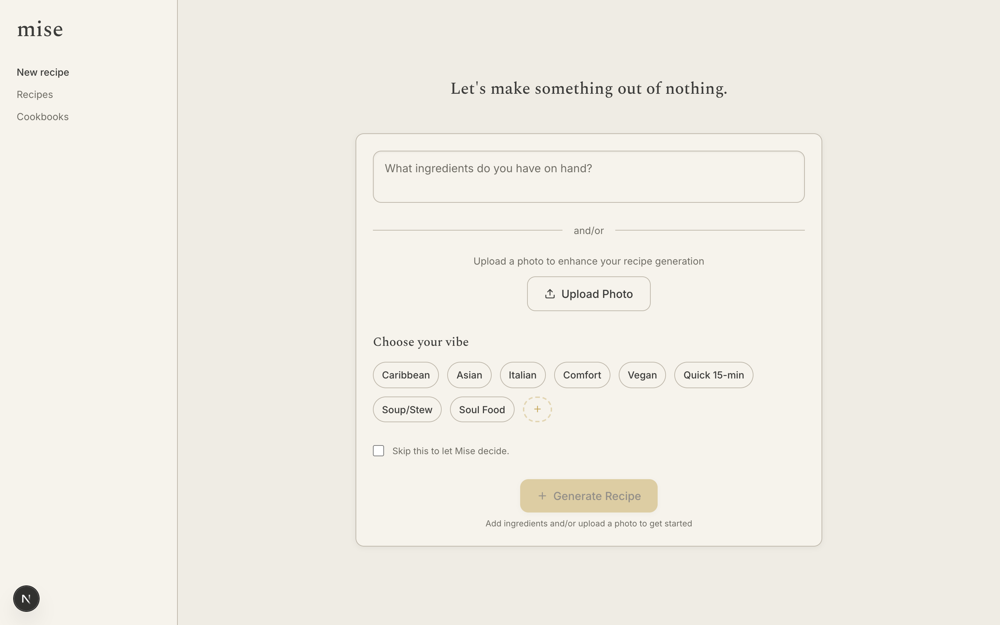

# Mise

**Turn whatever's in your kitchen into a recipe.** Type or photograph the ingredients you have, and Mise generates a complete recipe — with an AI-generated photo — that you can save and organize into cookbooks.

<p align="center">
  
</p>

The name comes from *mise en place* — everything in its place before you cook. Built with Next.js, OpenAI, and Supabase.

## Features

- **Recipe generation** from a list of ingredients, an uploaded photo, or both.
- **Vibes** — nudge the result (Asian, Italian, Comfort, Vegan, Quick 15-min…), or let Mise decide.
- **AI recipe images** created for each recipe.
- **Cookbooks** — save recipes and group them into themed collections.
- **PDF export** — turn a cookbook into a printable PDF.
- **Search** saved recipes by title, description, or cuisine.

## Tech stack

- **Next.js 16** (App Router) · **React 18** · **TypeScript**
- **Tailwind CSS** — a warm, minimal look (Spectral headings, Inter UI)
- **Supabase** (PostgreSQL) for storage
- **OpenAI** for recipe text and image generation
- **Sharp** (image compression) · **Puppeteer** (PDF export)

## Getting started

**Prerequisites:** Node.js 18+, a Supabase project, and an OpenAI API key.

**1. Install and configure**

```bash
npm install
cp .env.example .env.local   # then fill in your keys
```

**2. Set up the database**

```bash
npm run setup
```

The helper checks your credentials and prints the steps (and can output the SQL). Or do it by hand: run `database/schema.sql` in the Supabase SQL Editor to create the `recipes`, `cookbooks`, and `cookbook_recipes` tables and RLS policies, then optionally run `database/safe-seed-data.sql` for sample recipes.

**3. Run**

```bash
npm run dev
```

Open <http://localhost:3000>.

## Project structure

```
app/          Next.js routes — pages and API handlers
components/    UI (ingredient input, vibe selector, recipe display, cookbooks…)
lib/  utils/   Supabase client and helpers
database/      SQL schema and seed data
```

## Authentication

Browsing is open to everyone, but anything that writes data or spends money — creating, updating, deleting, and **generating** recipes — requires a signed-in user. It's enforced in [`middleware.ts`](middleware.ts) for every non-`GET` `/api` request, so it can't be bypassed from the client. Sign in at `/login` (Supabase email/password).

To keep the collection to just you, disable open sign-ups in Supabase (**Authentication → Providers → Email →** turn off *Allow new users to sign up*) and create your own account from the Supabase dashboard.

## License

© 2026 Nadirah Durr. All rights reserved.
